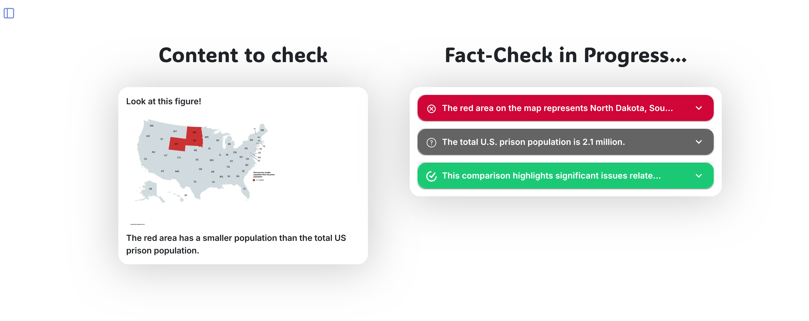

# Web User Interface for DEFAME

[](https://arxiv.org/abs/2412.10510)&nbsp;&nbsp;&nbsp;[](https://opensource.org/licenses/Apache-2.0)

This repository provides the web interface for [DEFAME](https://github.com/multimodal-ai-lab/DEFAME), an **automated fact-checking system**. The UI supports the input of textual _and_ visual content. It decomposes the input into manageable claims. All fact-checks are saved and can be retrieved later, renamed, or deleted.

As of now, our hosted web interface is **not public**, but you can [host it yourself](#usage).



This repository is the result of a student team project at the [Multimodal AI Lab](https://www.informatik.tu-darmstadt.de/mai/multimodal_ai/index.en.jsp).

## 📂 Structure
The repository is structured as follows:
- `client/` contains the frontend implementation, executed in the user's browser.
- `server/` contains the backend, managing the API calls to DEFAME and hosting a database to cache and provide the results.

## 🚀 Usage
1. Deploy [DEFAME's API](https://github.com/multimodal-ai-lab/DEFAME#API).
2. Update the `server/.env` file with the correct `AI_API_URL` (the link pointing at DEFAME's API).
2. Make sure you have [Docker](https://www.docker.com/products/docker-desktop/) installed.
3. Simply run
    ```bash
    docker compose up
    ```
   and Docker will handle the rest for you.
4. Access the UI at [http://localhost:5173](http://localhost:5173).

## 🤝 Collaboration
We are happy to receive any feedback, suggestions, or contributions. Feel free to open an issue or a pull request.

## [📃 License](LICENSE)
This repository and all its contents are licensed under the [Apache 2.0 License](http://www.apache.org/licenses/LICENSE-2.0).

## 🙏🏻 Acknowledgements
Many thanks go to

- [Aziz Makhlouf](https://github.com/aziz-2003)
- Baha Selmi
- Louey Ferchichi
- [Boumhroud Souhail](https://github.com/Souhailbou19)
- [Mohamed Khedimi](https://github.com/m0ckingbot)

for the implementation.
